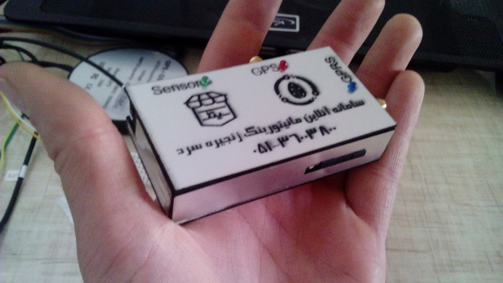
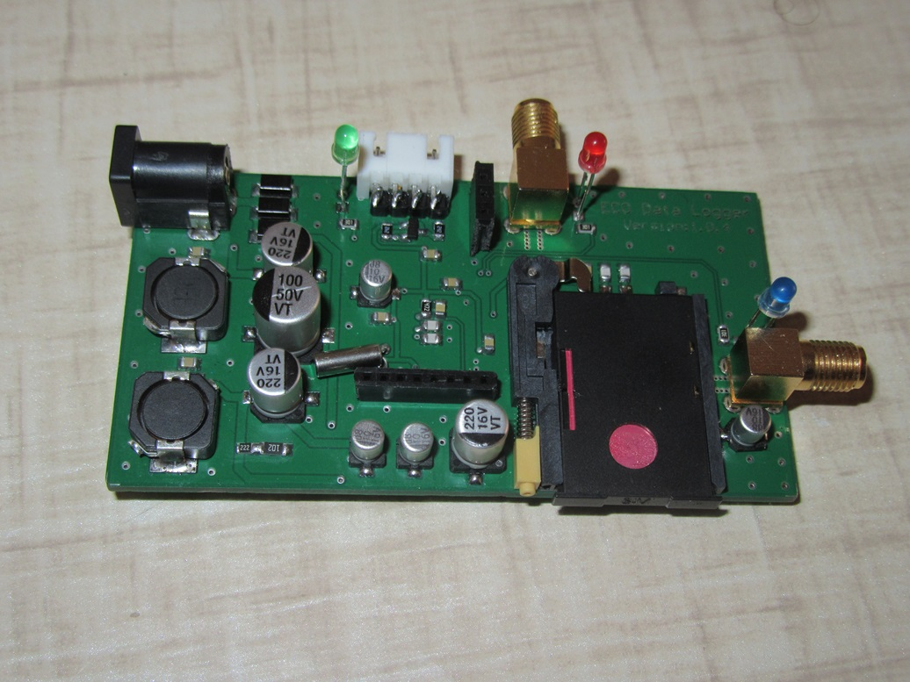
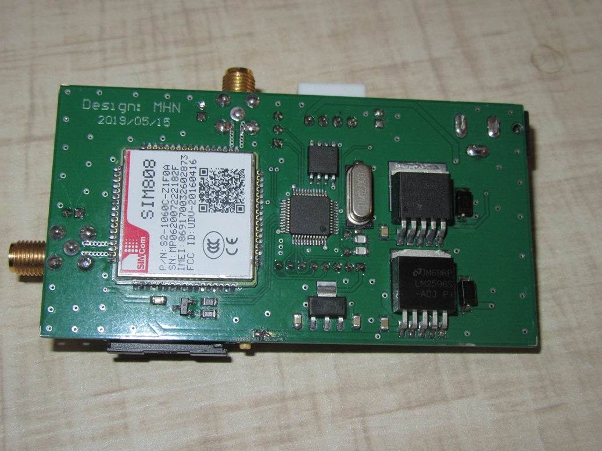

# Truck AVL (Automatic Vehicle Locator)

This project implements a vehicle tracking and logging system (AVL) designed for trucks. It uses an STM32 microcontroller to collect environmental data (temperature/humidity) and likely location/telemetry data, which is then transmitted or logged.

## Project Structure

The repository is organized as follows:

- **MCU Code/**: Firmware for the system.
    - **Logger_V.2.0/**: The main STM32CubeIDE project.
        - `Src/main.c`: Contains the initialization code for SPI, UART (x2), and a custom DHT sensor driver (`DHT_GetData`).
    - The code seems to target an **STM32F103** series microcontroller (Blue Pill or similar).

- **PCB/**:
    - `PCB1.PcbDoc`, `Sheet1.SchDoc`: Altium Designer files for the custom circuit board.
    - The design likely integrates the MCU, power management, sensor interfaces, and communication modules (GSM/GPS implied by "AVL").

- **Mechanical Design/**:
    - `.cdr` files (CorelDRAW): Designs for the device enclosure or mounting plates.

- **Media/**:
    - **Picture/**: Photos of the assembled PCB and the device.

## Features

- **Microcontroller**: Powered by an STM32F103 (ARM Cortex-M3).
- **Environmental Sensing**: Integrated driver for DHT series sensors (Temperature & Humidity).
- **Communication**:
    - **UART1 & UART2**: Likely used for GPS and GSM modules (typical for AVL) or debugging/PC interface.
    - **SPI**: For external peripherals (SD Card logger or other sensors).

## Usage

1. **Hardware**:
   - Fabricate the PCB using the files in `PCB/`.
   - Assemble components: STM32F103, DHT Sensor, and (implied) GPS/GSM modules.
2. **Firmware**:
   - Open `MCU Code/Logger_V.2.0/Logger_V.2.0.ioc` in STM32CubeIDE to view/modify pin configurations.
   - Build and flash the firmware to the microcontroller.
3. **Mechanical**:
   - Use the CorelDRAW files to laser cut or machine the enclosure.

## Gallery

